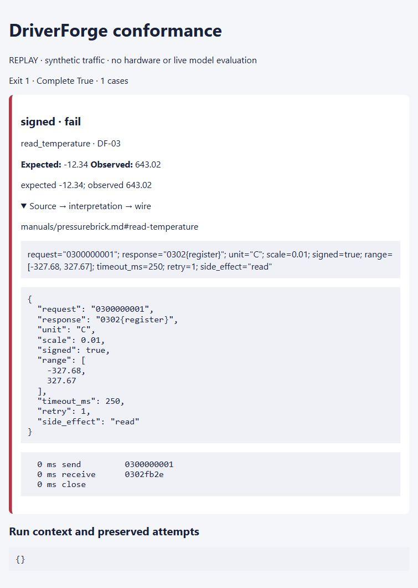

There is something funny about instrument software: getting a number back can feel like success long before you know whether it is the right number. A temperature of 643.02 is a perfectly respectable floating-point value. It is less respectable if the device meant -12.34.

I chose DriverForge as a small experiment in directing a coding agent through an engineering problem. Codex did the implementation work, using written requirements and an independent set of checks. I wanted something a reader could run without a bench instrument or a paid model account. The result is a local fault-testing extension for Python instrument drivers. Its source is now on GitHub as a software release candidate; this article remains a draft.

The first decision was whether the project deserved to exist. PyMeasure already has expected_protocol tests, and PyVISA-sim already simulates instruments from YAML. The agent installed pinned versions and exercised the same three operations with both: DC voltage, DC current, and resistance on PyMeasure's Agilent 34410A driver. Both worked. Building another happy-path simulator would have been a fairly elaborate way to duplicate a few assertions.

The narrower contribution is a reusable fault schedule and its evidence. A case can delay a response, split it into fragments, send malformed data, return a device error, or leave a late response after a timeout. The resulting report records exactly what was transmitted, how many times it was transmitted, what came back, and which source-backed contract was being checked. It plugs into PyMeasure's existing adapter constructor rather than asking someone to rewrite their driver.

The fictional fixtures make the byte-level checks easy to inspect. One speaks a small text protocol; the other returns big-endian registers. Neither is a real instrument, and none of the readings is a physical measurement. For the register fixture, the bytes FB 2E represent -1234 signed counts. At 0.01 degrees Celsius per count, that is -12.34 C. Treat those same bytes as unsigned and the driver reports 643.02 C. The checking program uses the hand-calculated answer, not the driver's conversion function.

*The retained unsigned-decoding defect fails against the source passage and exact response bytes. This screenshot comes from the local HTML report.*

That example is a deliberate defect, not evidence that a model spontaneously made the mistake. The offline demonstration is labeled REPLAY. It passes 39 reference cases and rejects six seeded defects, including swapped bytes, a voltage scale error, and an automatic retry of an uncertain write. A successful replay demonstrates the checking mechanism. It says nothing about a live model's success rate.

The uncertain-write case was worth making explicit. If a command changes an output and its acknowledgment disappears, another transmission might repeat the action. The fictional reference reads may retry once, within a 500 ms total budget. A transmitted write that times out gets an unknown-outcome error and is not replayed. A fake clock makes those decisions reproducible without waiting for a real instrument.

The existing driver also taught the project something less tidy. Under the synthetic malformed-response case, the unchanged Agilent driver returned text rather than the numeric reading required by the consumer contract. The report marks that as a failure. It also records unsupported cancellation and retry behavior instead of pretending those capabilities were tested successfully. This is a software simulation result, not a reproduced instrument fault or a diagnosis of an upstream hardware bug.

A separate consumer walkthrough provided a concrete repair. Its new input was a 2.500 V response, and its intentionally wrong calibration factor was 1000. The check preserved the expected 2.5 V and rejected the observed 2500 V. Changing only the consumer configuration to factor 1 made the same wire transcript pass. The package and upstream driver stayed unchanged. That is more useful feedback than an unexplained red test.

The implementation also needed ordinary packaging work: a repository-local virtual environment, pinned dependencies, an installable pytest fixture, lint and type checks, fresh-checkout installation, and artifact hashes. The checks include an offline run with credentials removed and Python socket egress denied. Generated-code execution stays disabled because a real isolation boundary was unavailable.

After installation, a reader can reproduce the demonstration with:

~~~text
python -m driverforge demo --offline --output artifacts/demo
~~~

The local report is artifacts/demo/report.html; requirement evidence and retained failures are under evidence/. The [repository](https://github.com/jewbee2000/driverforge) now includes the code, milestone history and recorded evidence.

I have a useful candidate tool and a repeatable consumer example, not field validation. The next stronger evidence would be an independent engineer trying it on their own driver. Physical behavior, calibration, broader vendor support, and live model experiments remain separate work. The project is more convincing with those limits visible.
